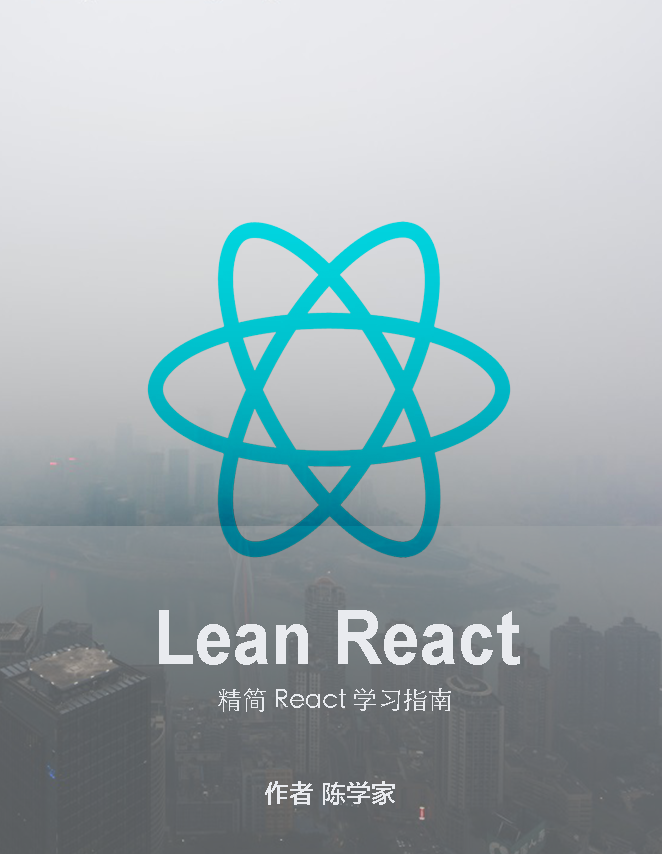

# Lean React
---

**目前本书正在撰写过程中，将这个目录结构先发出来，希望能得到更多读者的反馈，有任何想法和意见可以回 issue**

## 关于

应该是在 2013 年我还在天猫的时候，在一次团队会议中 Teamleader 邀请了来自 Facebook 的前端工程师来分享他们的开发栈，其中就有提到 React，当说到它有自己的独特语法的时候（JSX 语法），我对此不屑一顾，认为这样的前端框架只会昙花一现，顶多能够在 Facebook 内部流行起来。 但是到目前为止，React 的发展令我瞠目结舌，俨然已成为前端开发栈中的主角。

当我真正深入了解并在业务中使用 React 的时候，才意识到 React 是多么不可思议。 在 React 出现以前我们讨论过 MVC，MVVM，Web Component，这些模式不乏有很多出众的框架，但当我们了解了 React 的设计过后，会发现 React 回到了前端界面开发的本质 **数据和 UI 的结合表达**。 React 的设计可以简单理解为 **组件的组合模式和数据的单向流动**，正是这种极简的架构设计才能成为构建大型前端应用的基石。

虽然现在网上有很多关于 React 的书籍，课程等，但是总体看下来有以下的一些问题。

1. 内容主要是针对初级阶段的 React 学习者
2. 没有系统性介绍 React ，某些部分只是蜻蜓点水
3. 缺乏真实业务开发的实战介绍

所以打算写一本电子关于 React 的电子书，也当做 React 教学课程， 这本书的特点是：

1. 针对初级阶段的读者会系统性 step by step 的讲解 React 的基础知识
2. 系统性的介绍 React 开发生态中的技术
3. 有针对性的介绍 React 的特定主题，如数据可视化，自定义 Renderer, virtual DOM, 编辑器
4. 真实业务开发需要的资源或者组件的介绍
5. 实例代码和理论结合讲解
6. 针对部分章节配套视频讲解

简单而言，本书的目标：

> The Best React Book For React Beginners And Professionals

## 本书内容

这本书我会由简单到复杂的带领大家进入 React 的世界， 其中 1 - 3 章节都是 React 的基础知识，需要提醒读者的是大多数的基础知识都可以通过 React 的官方文档学习，如果对英语敏感的读者也可以看翻译。 对比官方文档本书 1 - 3 章会循序渐进的带领大家学习 React 基础知识，其中会有些自己的见解和领悟希望能让读者更容易理解学习，每个章节都会有一个实例作业，所以读者可以同时结合官方文档和本书进行学习。

> 有 React 基础的读者可以跳过 1 - 3 章节 ， 后面的章节都是独立的，可以打乱顺序挑选阅读

### 第一章：React 入门

本章会带领大家重 0 到 1 入门 React，会涉及到 React 背景和应用范围的介绍。 然后会介绍 React 的基础知识，包括 JSX 语法和 React 组件，Flux 模式介绍等。 

1.1 [React 介绍](https://segmentfault.com/a/1190000005140569)
1.2 [JSX 语法](https://segmentfault.com/a/1190000005145610)
1.3 React 组件
1.4 React 事件处理
1.5 React 样式
1.6 Flux 模式介绍

### 第二章：React 工程化 

现代化前端开发不仅仅是代码本身，会涉及到方方面面的前端开发知识。在真正开发代码之前，我们需要搭建包含 `gulp`、`webpack`、`babel es6 + jsx`、`livereload`、`less`、`jsminify`、`code watch` 这些功能的前端开发环境， 对于刚入门前端的读者来说可能会太复杂。 本章节会带领大家一一了解这些前端构建工具， 并最终搭建出包含这些功能的 React 开发环境。 

### 第三章：React 进阶

React 本身只有极少的 API，但深入了解这些 API 会对我们的开发大有裨益，本章会带领大家深入的了解 React 的一些核心操作，包括事件处理，生命周期，动画。 以及会详细介绍 Flux 模式 和 Immutable Js。

### 第四章：React 与 Redux

Redux 是目前 flux 模式最流行的实现，本章节会带领大家了解 Redux 的设计概念， 阅读 Redux 的源码，以及通过实例应用讲解 Redux + React 的开发模式。

### 第五章：React 实战业务开发 

真实业务开发中会遇到很多很多的问题，本章会把大多数在真实业务开发中遇到的场景进行讲解，涉及到如具体组件的开发，表单处理，后台交互等具体开发场景问题。

### 第六章：React 与 服务端渲染

React 除了可以在浏览器端渲染以外， 还可以在服务器端渲染 HTML， 本章节会实现一个 基于 express + React 模板渲染器，通过这个渲染器渲染第一章的 HTML。

### 第七章：React 与 数据可视化

数据可视化的需求日益增加，React 同样可以胜任数据可视化的工作，本章节会带领大家通过 React 实现一些基本的图表，讲解 React 和 D3.js 如何协作。

### 第八章：React 内部实现

当深入的学习和使用过 React 后， 一定会对 React 的内部运作机制好奇，本章节会部分介绍 React 内部的一些核心工作机制， 包括 Virtual DOM 算法， 生命周期内部运作方式。 

### 第九章：React 自定义 Renderer

React 独特的地方在于， virtual dom 这种组件的组合模式可以应用于很多地方， 除了 ReactDOM 渲染器实现外，我们可以实现一个自己的渲染器， 比如 D3 渲染器， PIXI.JS 渲染器， Three.js 渲染器。 

### 第十章：React 性能优化

本章节会介绍各种 React 开发过程中使用的性能优化场景，技巧。

### 扩展：React 资源
### 扩展*: 各种 React 组件实现
### 扩展*：各种应用源码分析