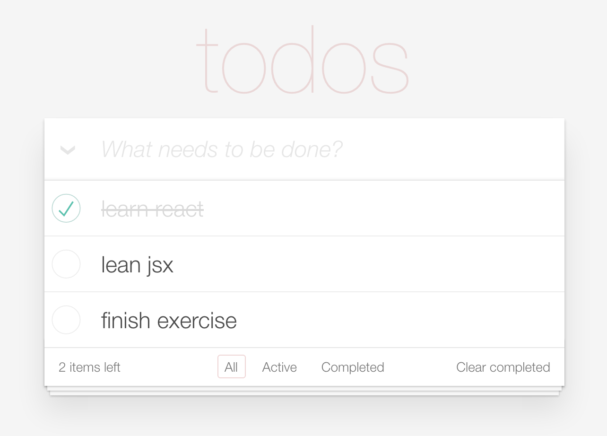

# JSX 

## 问题

根据一个 JSON 对象，用 React JSX 的方式渲染出 [TODOMVC](http://todomvc.com/examples/react/#/) 页面:



JSON 对象如下：

```javascript
var todolist = {
    name: "todos",
    todos: [{
            completed: false,
            title: 'finish exercise'
        }, {
            completed: false,
            title: 'lean jsx'
        }, {
            completed: true,
            title: 'lean react'
        }]
}
```

修改 index.html 中的代码，并参考 TODOMVC 页面中的 HTML 结构，css 已经在 index.html 中引入

## Tips 

1. class 要写为 className 
2. input 标签未闭合 
3. 数组遍历过后要添加 key 属性，否则会提示 error 信息（在组件章节会讲解）


